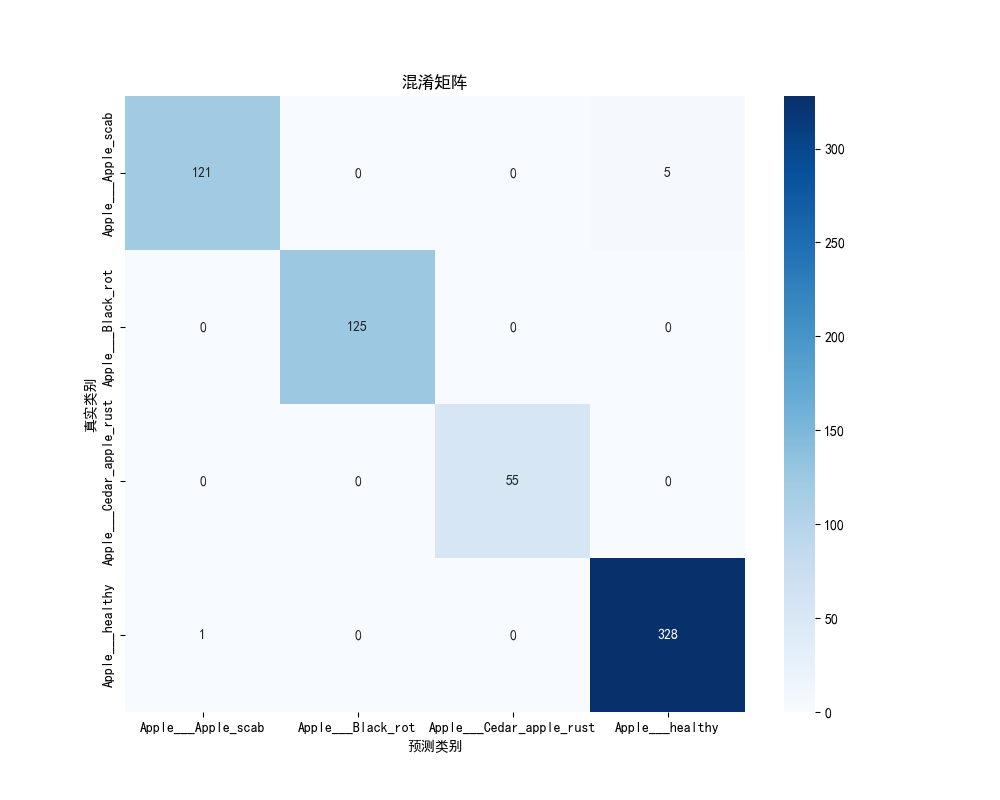
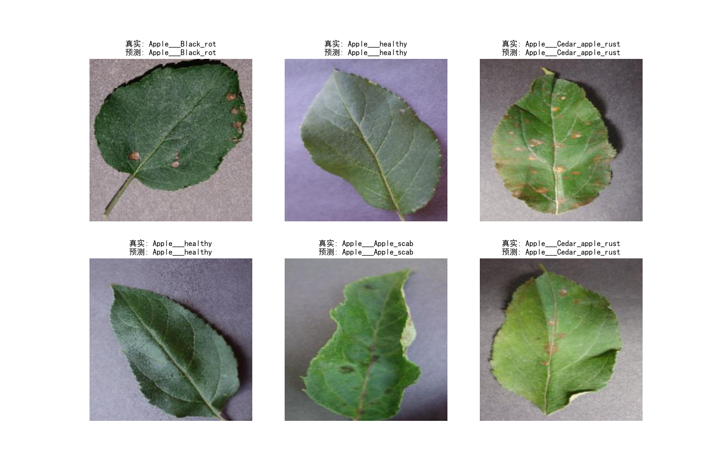
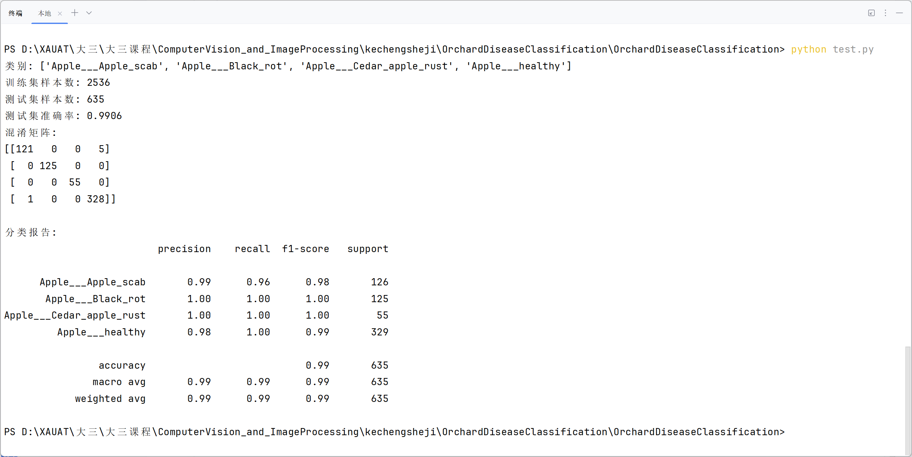
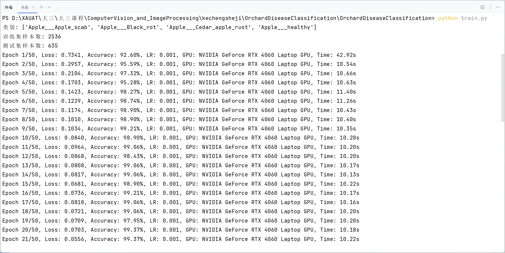

# 果园病虫害发病症状识别与分类模型设计

> 基于 PyTorch 与迁移学习的苹果叶片病害四分类模型，验证集准确率 **99.06%**。

## 项目背景

苹果叶片病害早期症状相似，人工判读依赖经验且效率低。本项目用深度学习做叶片图像自动分类，覆盖苹果常见的 3 种病害与健康状态，用于辅助果园病害快速筛查。

## 效果展示

| 混淆矩阵 | 预测结果可视化 |
|---|---|
|  |  |

| 分类报告 | 训练过程 |
|---|---|
|  |  |

## 快速开始

```bash
# 1. 安装依赖
pip install -r requirements.txt

# 2. 准备数据集
#    下载 PlantVillage 数据集中的苹果叶片部分，解压到 ./apple_source/
#    目录结构：
#      apple_source/
#        ├── Apple___Apple_scab/
#        ├── Apple___Black_rot/
#        ├── Apple___Cedar_apple_rust/
#        └── Apple___healthy/

# 3. 划分训练集 / 验证集（按类别 8:2）
python prepare_data.py

# 4. 训练（50 epoch，RTX 4060 Laptop 约 9 分钟）
python train.py

# 5. 评估（输出准确率、混淆矩阵、分类报告）
python test.py
```

## 数据集

使用公开数据集 **PlantVillage** 的苹果叶片部分，共 4 类 3171 张图像。

| 类别 | 训练集 | 验证集 | 合计 |
|---|---|---|---|
| Apple___Apple_scab（疮痂病） | 504 | 126 | 630 |
| Apple___Black_rot（黑腐病） | 496 | 125 | 621 |
| Apple___Cedar_apple_rust（锈病） | 220 | 55 | 275 |
| Apple___healthy（健康） | 1316 | 329 | 1645 |
| **合计** | **2536** | **635** | **3171** |

下载方式：（填写你的来源，如 Kaggle PlantVillage 链接或网盘）

**划分方式**：`prepare_data.py` 逐类随机打乱后按 8:2 切分，各类别独立划分，因此训练集与验证集的类别比例一致。

**注意**：本项目只划分了训练集与验证集，未设置独立测试集，报告中的准确率均为**验证集**指标。

## 方法

- **骨干网络**：ResNet18（ImageNet 预训练权重 `ResNet18_Weights.IMAGENET1K_V1`）
- **迁移策略**：冻结全部预训练层参数，仅替换最后的全连接层为 4 分类输出并训练
- **数据增强**（仅训练集）：随机水平翻转、随机旋转 ±10°、颜色抖动（亮度/对比度/饱和度 0.2）
- **预处理**：Resize 到 224×224，按 ImageNet 均值方差归一化
- **训练配置**：Adam（lr=1e-3）、CrossEntropyLoss、batch size 32、50 个 epoch
- **评估指标**：准确率、混淆矩阵、分类报告（Precision / Recall / F1）

## 实验结果

### 总体指标

| 指标 | 结果 |
|---|---|
| 准确率（验证集，第 50 轮） | 99.06% |
| 验证集最高准确率（第 46/47/49 轮） | 99.53% |
| macro avg F1 | 0.99 |
| weighted avg F1 | 0.99 |

### 各类别 F1

| 类别 | F1 | 样本数（验证集） |
|---|---|---|
| Apple___Apple_scab（疮痂病） | 0.98 | 126 |
| Apple___Black_rot（黑腐病） | 1.00 | 125 |
| Apple___Cedar_apple_rust（锈病） | 1.00 | 55 |
| Apple___healthy（健康） | 0.99 | 329 |

各类别 F1 均不低于 0.98。完整的 precision / recall 数值见 `assets/test.png`（`python test.py` 输出的分类报告原图）。

### 错误分析

混淆矩阵对角线为 121 / 125 / 55 / 328，验证集 635 张中仅 6 张误判：

| 真实类别 | 正确分类 | 误判去向 |
|---|---|---|
| Apple___Apple_scab | 121 / 126 | 5 张被判为 Apple___healthy |
| Apple___Black_rot | 125 / 125 | 无误判 |
| Apple___Cedar_apple_rust | 55 / 55 | 无误判 |
| Apple___healthy | 328 / 329 | 1 张被判为 Apple___Apple_scab |

**误判原因**：全部 6 个错误都发生在「疮痂病 ↔ 健康叶片」之间。早期疮痂病病斑面积小、颜色与健康组织差异微弱，模型难以捕捉有效判别特征；当前的增强策略（±10° 旋转、±20% 颜色抖动）对这类细微特征覆盖不足。

**改进方向**：
1. 针对疮痂病增强数据增强：更大幅度旋转、高斯噪声、随机擦除；
2. 换用更深或带注意力的网络：ResNet50、SE 通道注意力模块；
3. 引入空间注意力，使模型聚焦于病斑区域。

**已知问题**：
1. **类别不平衡**：健康样本 1645 张，锈病仅 275 张（约 6:1）。改进方向：类别加权损失、过采样 / 欠采样。
2. **权重保存的是最后一轮**：`train.py` 在训练循环结束后保存模型，未取验证集最优的一轮。改进方向：按验证集准确率保存最优权重。
3. **无独立测试集**：应划分 train / val / test 三部分，用测试集报告最终指标。
4. **泛化能力待检验**：模型仅在 PlantVillage 标准数据集（背景单一、拍摄条件规范）上验证，对复杂田间场景（光照不均、遮挡、多病害共存）的表现尚未检验。

## 项目结构

```
├── model.py          # ResNet18 迁移学习模型定义
├── dataset.py        # 数据加载与增强
├── prepare_data.py   # 数据集 8:2 划分
├── train.py          # 训练主循环与日志
├── test.py           # 评估、混淆矩阵、预测可视化
├── train_log.txt     # 50 轮训练日志
├── assets/           # 结果图
├── apple_source/     # 原始数据集（不上传）
├── data/             # 划分后的数据集（不上传）
└── best.pth          # 模型权重（不上传，可用 Git LFS 或 Release 发布）
```

## 技术栈

Python · PyTorch · torchvision · scikit-learn · matplotlib · seaborn

## TODO

- [ ] 划分独立测试集，用测试集报告最终指标
- [ ] 保存验证集最优权重而非最后一轮
- [ ] 用类别加权损失或采样策略缓解类别不平衡
- [ ] 导出 ONNX 做推理加速
- [ ] Gradio / Streamlit 搭建在线 demo
